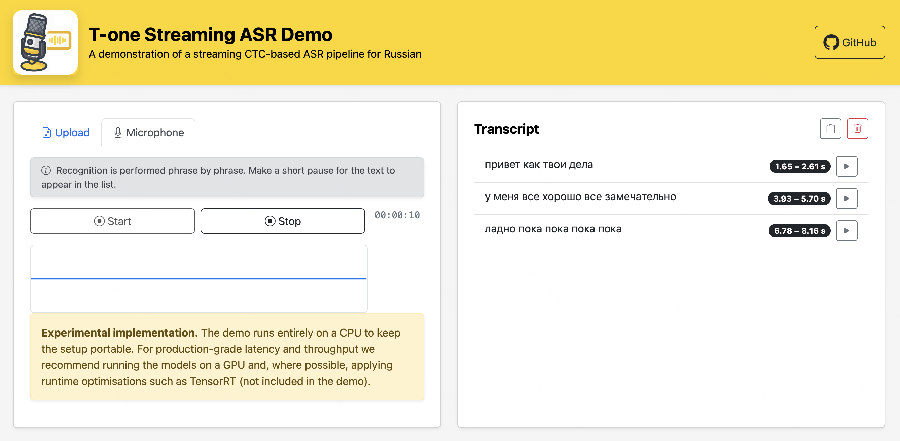
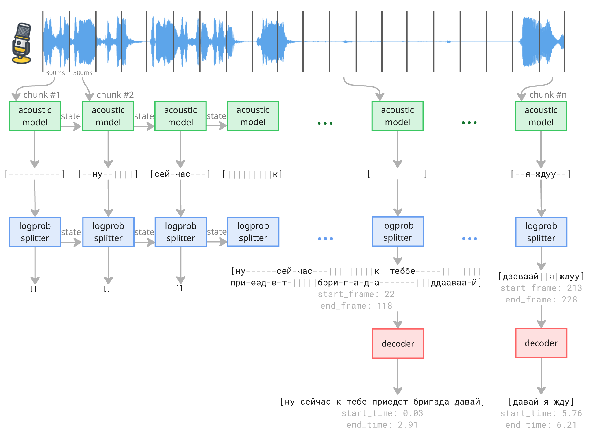

[](https://huggingface.co/t-tech/T-one)
[](https://hub.docker.com/r/tinkoffcreditsystems/t-one)
[](https://github.com/voicekit-team/T-one/blob/master/LICENSE)
[](https://www.python.org/downloads/)
[](https://python-poetry.org/)

<div align="center">
  <br/>
    <h1>T-one</h1>
  <p>Streaming CTC-based ASR pipeline for Russian</p>
  <p><b>English</b> | <a href="./README.ru.md">Русский</a></p>
</div>

## 📝 About The Project

This repository provides a complete streaming Automatic Speech Recognition (ASR) pipeline for **Russian, specialized for the telephony domain**. The pipeline includes a pretrained streaming [CTC-based](https://huggingface.co/learn/audio-course/chapter3/ctc) acoustic model, a streaming log-probabilities splitter and a decoder, making it a ready-to-use solution for real-time transcription. It processes audio in 300 ms chunks and detects phrase boundaries using a custom log-probability splitter. The final transcription is generated using either greedy decoding or a KenLM-based CTC beam search decoder. 
Originally developed by T-Software DC, this project is a practical low-latency, high-throughput ASR solution with modular components.

## ⚡️ Quick start / Demo

For a quick demo, simply run service with a web interface using our pre-built Docker image. You can **transcribe audio files** or **use your microphone** for real-time streaming recognition - all right in your browser.
*A computer with at least 4 CPU cores and 8 GB RAM is recommended for smooth performance.*

Run the container:
```bash
docker run -it --rm -p 8080:8080 tinkoffcreditsystems/t-one:0.1.0
```

Open the website `http://localhost:8080`.



Alternatively, you can build the image manually using [Dockerfile](Dockerfile) and run the container:
```bash
docker build -t t-one .
docker run -it --rm -p 8080:8080 t-one
```

## 🛠️ Installation & Usage

Ensure you have [Python](https://www.python.org/downloads/) (`3.9` or higher) and [Poetry](https://python-poetry.org/docs/#installation) (`2.1` or newer is recommended) installed on your Linux or macOS system.

It is recommended to use a containerized environment like Docker or [Windows Subsystem for Linux (WSL)](https://www.google.com/url?sa=E&q=https%3A%2F%2Fdocs.microsoft.com%2Fen-us%2Fwindows%2Fwsl%2Finstall) on Windows as the project dependency KenLM does not have official support for Windows. While it might be possible to install it on Windows (you can remove `kenlm` from Poetry dependencies and try to build it manually via [Vcpkg](https://github.com/kpu/kenlm?tab=readme-ov-file#building-kenlm---using-vcpkg)), it is generally more complex and prone to dependency issues.

### Installing and Running the Web Service

1. Clone the repository:
   ```bash
   git clone https://github.com/voicekit-team/T-one.git
   ```

2. Navigate to the repository directory:
   ```bash
   cd T-one
   ```

3. Create and activate a Python virtual environment:
   ```bash
   python -m venv .venv
   source .venv/bin/activate  # On Windows, use `.venv\Scripts\activate`
   ```

4. You can use [Makefile](Makefile) for local package and its dependencies installation and running the demo web-service:
   ```bash
   make install
   make up_dev
   ```

5. Open the website `http://localhost:8080`

Alternatively, you can install the package directly with Poetry after environment activation:

1. Install the package and its demo dependencies:
   ```bash
   poetry install -E demo
   ```

2. Run the demo web-service:
   ```bash
   uvicorn --host 0.0.0.0 --port 8080 tone.demo.website:app --reload
   ```

3. Open the website `http://localhost:8080`

Prepare an audio file with **Russian speech** in a common format (.wav, .mp3, .flac, .ogg) or use our [example audio](tone/demo/audio_examples/audio_short.flac) file.

### Python Inference

1. You can also run offline recognition directly in Python:
   ```python
   from tone import StreamingCTCPipeline, read_audio, read_example_audio


   audio = read_example_audio() # or read_audio("your_audio.flac")

   pipeline = StreamingCTCPipeline.from_hugging_face()
   print(pipeline.forward_offline(audio))  # run offline recognition
   ```

2. See the ["Advanced usage example"](#-advanced-usage-example) section for an example of streaming.

### Triton Inference Server

See the [manual](docs/triton_inference_server.md) for a detailed guide on how to export T-one acoustic model to `TensorRT` engine and run efficiently with `Triton Inference Server`.

### Model fine-tuning

1. Install the package and its fine-tuning dependencies:
   ```bash
   poetry install -E finetune
   ```
2. See the [fine-tuning example](examples/finetune_example.ipynb).

## 🎙️ ASR pipeline overview

Incoming audio is sliced into 300 ms segments on-the-fly (see a picture below). Each segment is fed to a Conformer-based acoustic model. The model receives an audio segment and a hidden state generated for the previous segment, preserves acoustic context across boundaries and returns a new hidden state with frame-level log-probabilities (aka logprobs) for each symbol in its output alphabet. Alphabet consists of Russian letters, space and blank token (special token that serves as a hard boundary between groups of characters).

The splitter takes the log-probabilities of the current audio segment and its own internal state as input. It returns an updated state and a list of any newly detected phrases. For each input frame, the splitter determines whether it contains speech. When the splitter detects a speech frame, the phrase is considered started (the first speech frame marks the beginning of the phrase). A phrase ends when the splitter finds N consecutive non-speech frames (the last speech frame before the silence marks the end of the phrase). Each phrase contains the corresponding logprobs along with start and end timestamps.

The decoder takes logprobs of phrases produced by the logprob splitter as inputs and converts them into text. There are two methods that can be used: Greedy decoding or Beam Search decoding with a KenLM language model. The resulting text along with phrase timings is returned to the client.

(Blank and space symbols are marked as '-' and '|' here)

For a detailed exploration of our architecture, design choices, and implementation, check out our accompanying [article](https://habr.com/ru/companies/tbank/articles/929850).

## 💪 Advanced usage example

```python
from tone import StreamingCTCPipeline, read_stream_example_audio


pipeline = StreamingCTCPipeline.from_hugging_face()

state = None  # Current state of the ASR pipeline (None - initial)
for audio_chunk in read_stream_example_audio():  # Use any source of audio chunks
    new_phrases, state = pipeline.forward(audio_chunk, state)
    print(new_phrases)

# Finalize the pipeline and get the remaining phrases
new_phrases, _ = pipeline.finalize(state)
print(new_phrases)
```

## 📊 Quality benchmarks

Word Error Rate ([WER](https://huggingface.co/spaces/evaluate-metric/wer)) is used to evaluate the quality of automatic speech recognition systems, which can be interpreted as incorrectly recognized words percentage compared to a reference transcript.

### WER comparison with other models
| Category | T-one (71M) | GigaAM-RNNT v2 (243M) | GigaAM-CTC v2 (242M) | Vosk-model-ru 0.54 (65M) | Vosk-model-small-streaming-ru 0.54 (20M) | Whisper large-v3 (1540M) |
|:--|:--|:--|:--|--:|:--|:--|
| Call-center | **8.63** | 10.22 | 10.57 | 11.28 | 15.53 | 19.39 |
| Other telephony | **6.20** | 7.88 | 8.15 | 8.69 | 13.49 | 17.29 |
| Named entities | **5.83** | 9.55 | 9.81 | 12.12 | 17.65 | 17.87 |
| CommonVoice 19 (test split) | 5.32 | **2.68** | 3.14 | 6.22 | 11.3 | 5.78 |
| OpenSTT asr_calls_2_val original | 20.27 | **20.07** | 21.24 | 22.64 | 29.45 | 29.02 |
| OpenSTT asr_calls_2_val re-labeled | **7.94** | 11.14 | 12.43 | 13.22 | 21.03 | 20.82 |

## 📈 Performance metrics

Here is `trtexec` model's throughput evaluated during export to TensorRT engine across different GPUs:

| Device               | Configuration   | Max  & Optimal Batch Size  |   RPS (Requests Per Second) |   SPS (Seconds Per Second) |
|:---------------------|:----------------|:---------------------------|:----------------------------|:---------------------------|
| T4                   | TensorRT        |                       32   |                        5952 |                       1786 |
| A30                  | TensorRT        |                      128   |                       17408 |                       5222 |
| A100                 | TensorRT        |                      256   |                       26112 |                       7833 |
| H100                 | TensorRT        |                     1024   |                       57344 |                      17203 |

Find more details on the performance metrics calculation method [here](docs/performance_testing.md).

## 📜 License

The code and models in this repository are released under the [Apache 2.0 License](./LICENSE).

## 📚 Additional Resources
- [T-one - an open-source streaming model for Russian telephony](https://habr.com/ru/companies/tbank/articles/929850).
- [How to improve quality and training speed of a streaming ASR model](https://www.youtube.com/watch?v=OQD9o1MdFRE).
